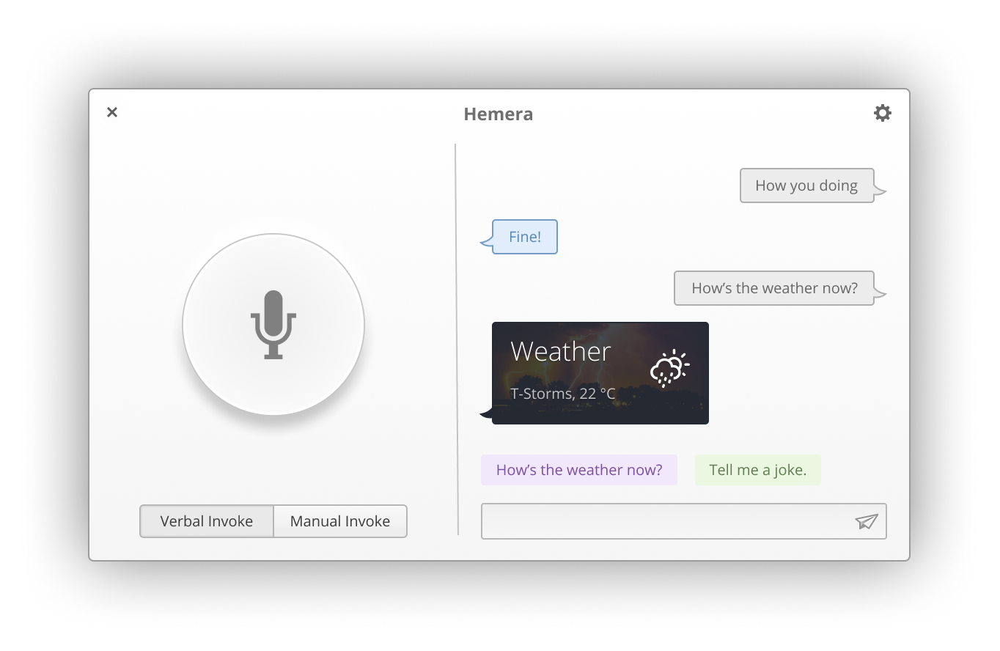

<div>
    <h1 align="center">Hemera</h1>
    <h3 align="center">Your own personal assistant for elementary OS based on Mycroft AI</h3>
</div>



<h6 align="center"><i>UI Mockup</i></h6>
<br>
Hemera is an interactive personal assistant application based in Vala, Gtk and Mycroft.

## Get it on elementary OS Appcenter
To be declared

## Install from source
You can install Hemera by compiling it from source, here's a list of required dependencies:
 - `gtk+-3.0>=3.18`
 - `granite>=0.5.0`
 - `glib-2.0`
 - `gobject-2.0`
 - `meson`
 - `libsoup2.4-dev`
 
Install dependencies
```
sudo apt install libsoup2.4-dev 
```
<i>For non-elementary distros, (such as Arch, Debian, etc) you are required to install "vala" as additional dependency.</i>

Clone repository and change directory
```
git clone https://github.com/SubhadeepJasu/hemera.git
cd hemera
```

Compile, install and start Melody on your system
```
meson build --prefix=/usr
cd build
sudo ninja install
com.github.SubhadeepJasu.hemera
```

<sup>**License**: GNU GPLv3</sup>
